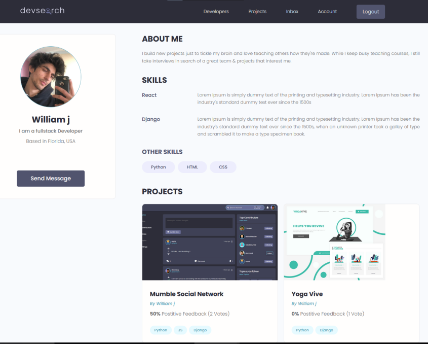

# DevSearch
DevSearch is a cutting-edge web platform built entirely on Django, offering a dynamic and user-friendly environment that empowers developers to showcase their projects, collaborate with like-minded peers, and gain recognition for their work. With an intuitive front-end design created using various UI kits and frameworks, such as Bootstrap, DevSearch ensures a seamless user experience.

# Installation
* 1 - clone repo https://github.com/mujtaba-jpj/DevSearch.git
* 2 - create a virtual environment and activate
*  - pip install virtualenv
*  - virtualenv envname
*  - envname\scripts\activate
* 3 - cd into project "cd DevSearch"
* 4 - pip install -r requirements.txt
* 5 - python manage.py runserver

# Features
* Share Projects
* Message other developers
* Rate others work
* Search other developers

# Project Overview
* Basic Django Overview
* Database Design and Models
* Static Files
* User Registration & Authenticaiton
* Search
* Pagination
* Building an API with Django REST Framework (DRF)
* Deployment

# Tech Stack
* Django
* Postgres
* Django REST Framework

# Home Page
  

# Projects Page
  

# Profile Page
  

# User Inbox
  

